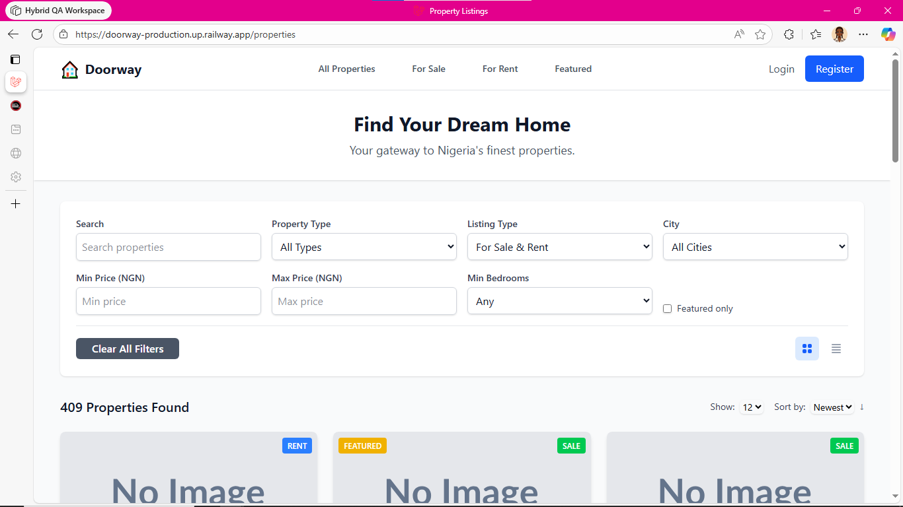
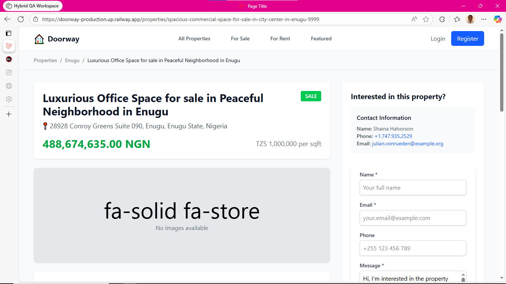
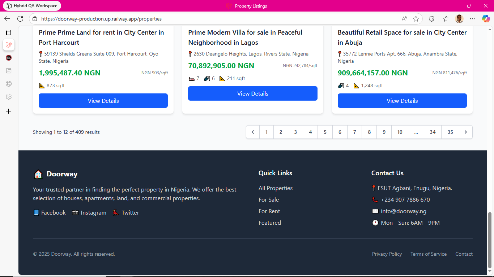

# Doorway  
Nigeria’s Best Real Estate App  
[](LICENSE)


## Project Banner

<p align="center">
  
</p>

---

## Screenshots (Table Layout)

| Homepage | Property Details |
|---------|------------------|
|  |  |

| Agent Dashboard | Mobile View |
|-----------------|-------------|
|  |  |

---

## Screenshots (Responsive Grid)

<p align="center">
  
  
</p>

<p align="center">
  
  
</p>

---

## Table of Contents  
- [Description](#description)  
- [Who It’s For](#who-its-for)  
- [Key Features](#key-features)  
- [Flow & Architecture](#flow--architecture)  
- [Getting Started](#getting-started)  
  - [Prerequisites](#prerequisites)  
  - [Installation](#installation)  
  - [Configuration](#configuration)  
  - [Running Locally](#running-locally)  
  - [Running Tests](#running-tests)  
- [Folder Structure](#folder-structure)  
- [Use Cases & Impact](#use-cases--impact)  
- [Contributing](#contributing)  
- [License](#license)  

---


## Description  
`Doorway` is a full-stack real estate platform built for the Nigerian market. It empowers users (buyers, renters, agents and property managers) to discover, list and transact properties with ease. The system is built using a modern PHP-Laravel backend, Blade/Tailwind frontend, with deploy-ready config (Railway, Nixpacks, etc.).  
It has been designed from the ground up to scale, to support thousands of listings, and to cater to the fast-moving Nigerian property market.

---


## Who It’s For  
- **Home-seekers** in Nigeria who want to browse properties for sale or rent.  
- **Real estate agents** or agencies seeking a digital presence and listing management.  
- **Property managers/landlords** who need to list and manage multiple properties.  
- **Developers** who want to use or extend a clean base real‐estate platform (you as the engineer) to build custom modules: features like Cloudinary upload, user dashboards, analytics, etc.

---


## Key Features  
- User registration, login, and role-based access (guest, agent, admin).  
- Property listing: add, edit, remove, upload media, assign to agents.  
- Search & filters: location, price, type, availability (sale/rent).  
- Frontend interface styled with Tailwind + Blade for responsive design.  
- Backend built with Laravel: clean architecture, config ready for deployment.  
- Deployment config included: `Procfile`, `railway.toml`, `nixpacks.toml` → supports modern cloud platforms.  
- Test suite (PHPUnit) scaffolding included for quality assurance.

---


## Flow & Architecture  
1. **User journey**: A prospective buyer visits the homepage, uses search filters (location, price, type). They view a property detail page, contact the agent or submit an interest form.  
2. **Agent/Admin flow**: Agent logs in → dashboard → creates new listing → uploads media → publishes. Admin monitors all activity, manages users, approves listings.  
3. **Tech stack**:  
   - PHP 8.x + Laravel framework (backend business logic, controllers, models)  
   - Blade templating + Tailwind CSS (frontend UI)  
   - MySQL / PostgreSQL for data storage  
   - Storage configuration for media uploads (can integrate with Cloudinary or local).  
   - Deployment files allow one-click in cloud platforms (Railway, Heroku style)  
   - Unit tests (in `/tests`) for core backend functions.  
4. **Folder structure** (see below) ensures separation of concerns and future extensibility.

---


## Getting Started  

### Prerequisites  
- PHP 8.x  
- Composer  
- Node.js + NPM (for frontend assets)  
- A relational database (e.g., MySQL)  
- (Optional) Cloud platform account for deployment  

---

### Installation  
```bash
git clone https://github.com/Dabeey/doorway.git
cd doorway
composer install
npm install
npm run dev
```

---

### Configuration

Copy example environment file:

```bash
cp .env.example .env
```

Then set your database credentials, APP_URL, mail settings, storage settings.

Run migrations and seeders:

```bash
php artisan migrate --seed
```

---

## Running Locally

Start the built-in Laravel server:

```bash
php artisan serve
```

Visit:

```
http://127.0.0.1:8000
```

---

## Running Tests

To execute the test suite:

```bash
php artisan test
```

---

## Folder Structure

```
/
├── app/               # Core application code (models, controllers)
├── bootstrap/         # Application bootstrap files
├── config/            # Configuration files 
├── database/          # Migrations, factories, seeders
├── public/            # Publicly accessible assets, index.php
├── resources/         # Views (Blade), assets (Tailwind, JS), language files
├── routes/            # Route definitions (web.php, api.php)
├── storage/           # Logs, sessions, compiled views
├── tests/             # Automated tests
├── .github/workflows/ # CI/CD workflow files
├── Procfile           # Deployment instructions
├── nixpacks.toml      # Deployment config for Nixpacks
└── …
```

Each area is clearly defined so you can locate exactly where to place new features, add integrations (e.g., AI-based property valuation, analytics dashboards), and maintain clean architecture.

---

## Use Cases & Impact

**For a home-buyer:**  
Instantly browse verified properties across Nigeria, saving time vs manual listings.

**For an agent/agency:**  
Launch a professional digital listing platform without building from scratch, capturing leads and streamlining operations.

**For property markets:**  
Digitizes traditional workflows, increasing transparency, speeding up transactions, and reducing friction.

**For the developer (you):**  
A base project you can customize, scale, and reuse for future real-estate ventures or SaaS offerings.

Because the system supports scalable architecture and deployment, it can easily grow to hundreds of listings, thousands of users, and incorporate advanced modules (analytics, AI valuations, virtual tours). This elevates the value-proposition for agents, increases listing volume, and accelerates time-to-market for developers/entrepreneurs.

---

## Contributing

Contributions are welcome. Please follow these steps:

1. Fork the repository.
2. Create your feature branch:
   ```bash
   git checkout -b feature/YourFeature
   ```
3. Commit your changes:
   ```bash
   git commit -m "Add YourFeature"
   ```
4. Push to the branch:
   ```bash
   git push origin feature/YourFeature
   ```
5. Open a Pull Request.

Ensure you write tests and update documentation accordingly.

---

## License

This project is licensed under the **MIT License**.
